 

<h2 align="center">🧑‍💻 Something about me 🧑‍💻</h2>
 
<h3 align="center">👋 Hello, I'm Khoa Nguyen, as known as yunkhngn.</h3>
<h3>- 👀 I'm a software engineer/graphic designer.</h3>
<h3>- 🌱 I use most of those languages including Javascript, C++, Python, Java...</h3>
<h3>- ☕ And some of popular framework such as ReactJS, NextJS and some material libraries,...</h3>
<h3>- 🎸 I play guitars and do music stuffs</h3>
<h3>- 📫 Find me in <a href="https:www.khoanguyen.codes/" target="_blank">here</a>.</h3>
 

<h2 align="center">🛠 Technologies and Tools 🛠</h2>
 
<!-- https://simpleicons.org/ --> 

&nbsp;

&nbsp;

&nbsp;

&nbsp;

&nbsp;
&nbsp;

&nbsp;

&nbsp;

&nbsp;
&nbsp;

&nbsp;

&nbsp;

&nbsp;

&nbsp;

 
<h2 align="center">🔥 GitHub Stats 🔥</h2>
 

  

 
 

<h2 align="center">👽 Where to find me 👽</h2>
 
<!-- https://icons8.com -->

  
  
  <!-- github -->
  
  <!-- behance -->
  

 

<h2 align="center">📑 My Favorites Quote 📑</h2>
 

